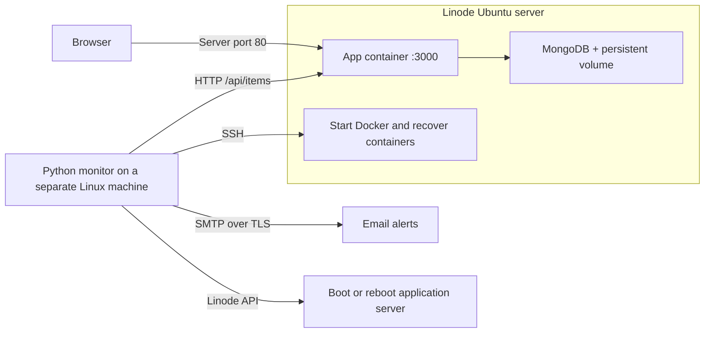

# Website Monitoring and Recovery

A Python, Linode, Docker, and Linux project using **`ankit42098/testing-app:v1`**.
Python uses only the standard library; no pip packages are required.

The supplied image runs a Node/Express application on port **3000** and requires
`MONGODB_URI`. The Compose stack includes MongoDB 8.0 and a persistent database
volume. MongoDB is reachable only inside the Docker network; its port is not
published. Open `http://SERVER_IP/` to use the website.

## Architecture



Run the monitor on your Linux workstation for a demo, or on a separate always-on
Linux host for continuous monitoring. It must stay running when the application
server fails. A sleeping laptop cannot provide continuous monitoring.

| Requirement | Implementation |
| --- | --- |
| Provision a Linux cloud server | `provision.py`: Ubuntu 24.04 Linode and cloud firewall |
| Install Docker remotely | `deploy.py` + `install-docker.sh`: official Docker apt repository |
| Deploy the application | `compose.yaml`: supplied image and MongoDB |
| Validate website responses | `health.py`: exact HTTP status and optional response text |
| Send email notifications | `notify.py`: SMTP with STARTTLS or SSL |
| Recover the application | `recovery.py`: start Docker, start the stack, restart the app |
| Recover the server | `recovery.py`: Linode API boot/reboot |
| Automate everything | `monitor.py` + `systemd/website-monitor.service` |

## 1. Prepare the monitoring machine

You need Linux, Python 3.10+, OpenSSH client, a Linode account, and an SMTP account.
The application server is a separate, fresh Ubuntu 24.04 machine. The default
Linode plan is `g6-standard-1` (2 GiB) for the app and database.

From this project directory:

```bash
cp config.example.json config.json
cp .env.example .env
chmod 600 config.json .env
ssh-keygen -t ed25519 -f ~/.ssh/website-monitor
```

For unattended SSH, use a dedicated key without a passphrase, protected by file
permissions. A passphrase-protected key works only if an appropriate SSH agent is
available; the supplied systemd service does not configure one.

Edit `.env` locally. Add your Linode API token and SMTP credentials (an app password
if required by your mail provider). Do not paste credentials into Git or chat.
Provisioning needs Linode and Firewall read/write scopes; ongoing server recovery
only needs Linode read/write access to this instance. Configure the SMTP host,
port, sender and recipients in `config.json`. Use `starttls` with port 587 or `ssl`
with port 465, according to your provider.

Load secrets into the current shell before running Python commands:

```bash
set -a
source .env
set +a
```

The Python scripts read secrets from the environment, not directly from `.env`.

## 2. Provision Linode

Choose a region ID available to your account. Use the **public outbound IPv4 of
the monitoring machine** for `--admin-cidr`; the example IP below is a placeholder.
Provisioning creates billable cloud resources when you run this command.

```bash
python3 provision.py \
  --region YOUR_REGION_ID \
  --ssh-public-key ~/.ssh/website-monitor.pub \
  --admin-cidr YOUR_MONITOR_PUBLIC_IP/32
```

The script prompts for an initial root password, writes `deployment.json`, attaches
a cloud firewall, and then boots the machine. SSH is allowed only from the supplied
CIDR; public HTTP port 80 is allowed; other inbound traffic is dropped. Outbound
traffic is allowed. Use `--web-port` and the matching `host_port` configuration if
you want another public application port.

This provisioner explicitly uses legacy configuration interfaces, supported by
Linode's API. Your account must allow them. It does not change account-wide interface
settings. An existing Ubuntu server can also be used: skip this step and configure
its IP, SSH access, firewall and Linode ID yourself.

If provisioning is interrupted, preserve `deployment.json` and rerun the same
command to resume. If a create request timed out, inspect Cloud Manager before
retrying: a resource may exist even without a successful response. A failed firewall
step can leave an allocated, billable instance; inspect and finish or delete it.

## 3. Configure and deploy

Edit these fields in `config.json` using the provisioning output:

```json
{
  "website_url": "http://YOUR_SERVER_IP/api/items",
  "ssh_host": "YOUR_SERVER_IP",
  "linode_id": 123456,
  "ssh_key": "/absolute/path/to/.ssh/website-monitor",
  "ssh_known_hosts": "/absolute/path/to/.ssh/known_hosts"
}
```

These are fields to edit in the existing file, not a second configuration file.
Keep `image` as `ankit42098/testing-app:v1` and `container_port` as `3000`.
`/api/items` checks both the application and its MongoDB connection. The image's
`/api/health` endpoint returns a static success response without querying MongoDB.
Use `/` instead if you specifically want to monitor only the homepage.

Connect once and verify the host fingerprint against the server's SSH host key
fingerprint shown through Linode's console before accepting it:

```bash
ssh -i ~/.ssh/website-monitor root@YOUR_SERVER_IP
```

In Linode's console, `ssh-keygen -lf /etc/ssh/ssh_host_ed25519_key.pub` displays the
ED25519 host fingerprint. Exit the SSH session after verifying access. Automated
commands require an existing trusted `known_hosts` entry; they never disable host
key checking. The default remote user is root. A different remote user must have
passwordless sudo for the deployment and recovery commands.

```bash
python3 deploy.py
python3 monitor.py --check-only
python3 notify.py
```

Deployment installs Docker, enables it at boot, disables SSH password authentication,
and uploads the stack to `/opt/website-monitoring`. It pulls images and starts the
database before the app. Docker's `always` restart policy restores exited containers
and starts them again after a server reboot. Database records survive container
recreation and host reboot through the named `mongo-data` volume.

`--check-only` returns exit code 0 when the configured endpoint is healthy, 1 when
unhealthy, and never sends alerts or performs recovery. If startup fails, inspect:

```bash
ssh -i ~/.ssh/website-monitor root@YOUR_SERVER_IP \
  'cd /opt/website-monitoring && docker compose ps && docker compose logs --tail=50'
```

## 4. Start automatic monitoring

```bash
python3 monitor.py
```

By default, the monitor checks every 30 seconds and acts after three consecutive
failures. It validates the exact status code (200 by default), verifies HTTPS
certificates for HTTPS URLs, and optionally searches the first 1 MiB for
`expected_text`. Redirects do not silently count as success.

Recovery proceeds as follows:

1. Queue an outage email after the failure threshold.
2. Start Docker if stopped, run `docker compose up -d`, and restart the app.
3. Wait at least 120 seconds before another recovery attempt; allow two container
   recovery attempts per incident.
4. If enabled, diagnose the same HTTP path from inside the server. A locally healthy
   app prevents reboot; investigate the public network instead. Authentication or
   host-key errors also prevent reboot. Network refusal/timeouts or a failing local
   HTTP check can permit server recovery.
5. Verify that `ssh_host` belongs to `linode_id`, then boot an offline instance or
   reboot a running one. Allow one server attempt per incident, 180 seconds of boot
   grace, and at least 30 minutes between server attempts across incidents.
6. Send a recovery email when HTTP succeeds again and reset the incident's budgets.

Enable server recovery by setting `enable_server_recovery` to `true` after filling
in `linode_id`, the server's public IPv4 in `ssh_host`, and `LINODE_TOKEN`. It starts
disabled so an unfinished configuration cannot reboot a machine.

The monitor records intent before executing recovery commands. Failed or ambiguous
server API requests consume the incident's server attempt, preventing repeated
reboots. Transitional Linode states are left alone. If the budget is exhausted and
HTTP stays unhealthy, monitoring continues but an operator must fix the fault.

State and pending email events survive monitor restarts. A file lock prevents two
monitors using the same state file concurrently; do not run separate copies with
different state files against the same application. SMTP failures are retried without
blocking the recovery decision. Alerts use a bounded queue of the latest 50 events;
delivery is at-least-once, so a crash immediately after SMTP acceptance can duplicate
an email. `--once` performs one check **with recovery**, using the same persistent
state; use `--check-only` for a read-only check.

## 5. Run the monitor as a Linux service

Run these commands on the **separate monitoring machine**, from this project folder.
The dedicated service user stores its SSH key and state outside your home directory.

```bash
sudo useradd --system --home /var/lib/website-monitoring-recovery --shell /usr/sbin/nologin website-monitor
sudo install -d -m 755 /opt/website-monitoring-recovery
sudo install -d -m 700 -o website-monitor -g website-monitor /var/lib/website-monitoring-recovery
sudo install -m 644 common.py health.py monitor.py notify.py recovery.py config.example.json /opt/website-monitoring-recovery/
sudo install -m 640 -o root -g website-monitor config.json /opt/website-monitoring-recovery/config.json
sudo install -m 600 .env /etc/website-monitoring-recovery.env
sudo install -m 600 -o website-monitor -g website-monitor ~/.ssh/website-monitor /var/lib/website-monitoring-recovery/id_ed25519
sudo install -m 600 -o website-monitor -g website-monitor ~/.ssh/known_hosts /var/lib/website-monitoring-recovery/known_hosts
sudoedit /opt/website-monitoring-recovery/config.json
```

In the installed config, set:

```json
{
  "ssh_key": "/var/lib/website-monitoring-recovery/id_ed25519",
  "ssh_known_hosts": "/var/lib/website-monitoring-recovery/known_hosts",
  "state_file": "/var/lib/website-monitoring-recovery/monitor.json"
}
```

Stop any foreground monitor first. If it already handled an incident, also preserve
its recovery state when switching to the service:

```bash
# Only when state/monitor.json already exists:
sudo install -m 600 -o website-monitor -g website-monitor state/monitor.json /var/lib/website-monitoring-recovery/monitor.json
```

```bash
sudo install -m 644 systemd/website-monitor.service /etc/systemd/system/website-monitor.service
sudo systemctl daemon-reload
sudo systemctl enable --now website-monitor
sudo systemctl status website-monitor
sudo journalctl -u website-monitor -f
```

The service launches on boot and restarts on process failure. Edit
`/etc/website-monitoring-recovery.env` for credential changes, then restart the
service. If the monitor moves to a different machine/network, update the cloud
firewall's SSH source CIDR too.

## Testing and failure drills

Run the automated tests without cloud credentials, a mail account, or Docker:

```bash
python3 -m unittest discover -s tests -v
bash -n install-docker.sh
docker compose config --quiet
```

Tests cover response validation, outage thresholds, persistent recovery budgets,
cooldowns, SMTP retry, wrong-instance protection, and boot versus reboot decisions.
Cloud and SSH actions are mocked; these tests do not prove a live deployment works.

On your test Linode, stop the app to exercise monitor-driven recovery:

```bash
ssh -i ~/.ssh/website-monitor root@YOUR_SERVER_IP 'docker stop website-app'
```

Watch the monitoring log for the outage, recovery command, then a successful HTTP
check. Docker alone handles process crashes; explicitly stopping a container lets
you observe Python bringing it back. For a server recovery drill, enable server
recovery and shut down the test Linode through Cloud Manager. Keep the monitor
running on its separate host; it should exhaust SSH recovery attempts, then request
an API boot. A dashboard reload and email arrival confirm the full workflow.

For maintenance, stop the **monitor service first**, then stop the app. Otherwise,
the monitor intentionally undoes your manual stop. Do not delete the database
volume during ordinary recovery. Delete the test Linode and its cloud firewall
through Cloud Manager when finished to stop ongoing resource charges.

## References

- Docker installation follows the [official Ubuntu installation instructions](https://docs.docker.com/engine/install/ubuntu/).
- Container lifecycle follows [Docker restart policies](https://docs.docker.com/engine/containers/start-containers-automatically/).
- Provisioning uses [Create a Linode](https://techdocs.akamai.com/linode-api/reference/post-linode-instance) and [Create a firewall](https://techdocs.akamai.com/linode-api/reference/post-firewalls).
- Server recovery uses Linode's [boot](https://techdocs.akamai.com/linode-api/reference/post-boot-linode-instance) and [reboot](https://techdocs.akamai.com/linode-api/reference/post-reboot-linode-instance) endpoints.
- Database container configuration uses the [official MongoDB Docker image](https://hub.docker.com/_/mongo/).
